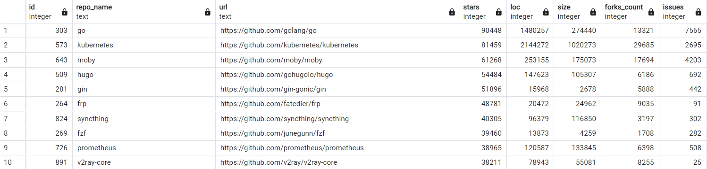

# README

This repository cotains the data and code for the paper "An Empirical Study of CGO Usage in Go Projects – Distribution, Purposes, Patterns and Critical Issues".

file structure:
```
- cgo.dump # our database, including all repos, files, issues, etc we studied.
- go1.17.7_cgoptr.tar.gz # our temporary approach based on Go1.17.7 to eliminate unnecessary pointer checks.
- CGOAnalyzer/ # our CGOAnalyzer tool which is used to analyze the CGO usage in Go projects.
```

## How to use

### Our dataset: `cgo.dump`

Our dataset is stored in a PostgreSQL database dump file named `cgo.dump`. For how to import the dump file into your PostgreSQL database, see the [installation guide](install.md).

some important tables & views in the database:

- `repos`: all the Go repositories we got.
- `repository_stars_1000`: the top 1000 starred Go repositories.
- `rp_stars_1000_valid`: the top 1000 starred Go repositories that are valid (i.e., the repository is not out-of-date).
- `rp_cgo`: the Go repositories that use CGO.
- `package`: all the packages in the repositories.
- `file`: all the files in the repositories.
- `cgo_issues_final`: identified CGO-related issues and corresponding labels.
- `cgo_funciton`: identified CGO functions.
- `cgo_header`: identified CGO headers.
- `cgo_invocation`: identified CGO invocations.
- `export_function`: identified exported Go functions.
- `patterns`: identified CGO patterns.
- ...


`rp_stars_1000_valid` preview(using PgAdmin mentioned in the installation guide):




### Use our approach based on Go1.17.7 to eliminate unnecessary pointer checks

We provide a temporary approach based on Go1.17.7 to eliminate unnecessary CGO pointer checks. The approach is implemented by modifying the Go toolchain source code. The modified toolchain can be used to build Go projects, which can eliminate unnecessary pointer checks in the generated binary. To build our modified Go toolchain, see [installation guide](install.md).

you can use `go tool cgo` command to generate the code after CGO preprocessing and see the difference between the original and modified toolchain. For example, for the following code `main.go`:

```go
package main

/*
void testPtr(void *p) {}
*/
import "C"
import "unsafe"

func main() {
	b := []byte{1, 2, 3}
	var p *byte
	p = &b[0]
	C.testPtr(unsafe.Pointer(p))
}
```

You can use `go tool cgo main.go` to generate the code after CGO preprocessing. The generated preprocessed code(`main.cgo1.go`) will be in the `_obj` directory. The `_obj` directory contains the following files:

```
_obj
├── _cgo_export.c
├── _cgo_export.h
├── _cgo_flags
├── _cgo_gotypes.go
├── _cgo_main.c
├── _cgo_.o
├── main.cgo1.go // code after CGO preprocessing
└── main.cgo2.c
```

You can compare the generated `main.cgo1.go` file between the original and modified toolchain to see the difference.

`main.cgo1.go` generated by the original Go toolchain:

```go
// Code generated by cmd/cgo; DO NOT EDIT.

//line main.go:1:1
package main

/*
void testPtr(void *p) {}
*/
import _ "unsafe"
import "unsafe"

func main() {
	b := []byte{1, 2, 3}
	var p *byte
	p = &b[0]
	func() { _cgo0 := /*line :13:12*/unsafe.Pointer(p); _cgoCheckPointer(_cgo0, nil); _Cfunc_testPtr(_cgo0); }()
}
```

`main.cgo1.go` generated by our modified Go toolchain:

```go
// Code generated by cmd/cgo; DO NOT EDIT.

//line main.go:1:1
package main

/*
void testPtr(void *p) {}
*/
import _ "unsafe"
import "unsafe"

func main() {
	b := []byte{1, 2, 3}
	var p *byte
	p = &b[0]
	( /*line :13:2*/_Cfunc_testPtr /*line :13:10*/)(unsafe.Pointer(p))
}
```

The difference is that the unnecessary pointer check `_cgoCheckPointer` is eliminated by our modified toolchain.

### Our proposal

https://github.com/golang/go/issues/70274 is our proposal to integrate CGO as part of the Go compiler, and to reuse the compiler's analysis pass results, such as type inference and pointer analysis results. Our proposal is grouped with https://github.com/golang/go/issues/16623 in the Go issue tracker.

### Our CGOAnalyzer tool

see [CGOAnalyzer/README.md](CGOAnalyzer/README.md) for details.
